# Vintage Synth MIDI Studio — mode d'emploi

Un séquenceur MIDI, un rack de machines vintage modélisées, et une chaîne qui
reconstruit un morceau enregistré en projet jouable.

**44 machines · 13 effets · 1 001 paramètres nommés · 1 337 tests verts**

> Toutes les illustrations sont des rendus de l'application elle-même, produits hors
> écran par `vsm-panel-preview`, `vsm-ui-preview`, `vsm-pianoroll-preview` et
> `vsm-arrangement-preview`, à l'échelle d'interface 150 %.

## 1. La fenêtre

Tout vit dans **une seule fenêtre** : le transport en haut, les pistes à gauche, le morceau au centre — l'arrangement *ou* le piano roll, on passe de l'un à l'autre par le menu Affichage —, la façade de la piste sélectionnée à droite, la console en bas.

**Chaque frontière porte une poignée** : elle se tire à la souris, et la taille choisie est conservée d'une session à l'autre. Masquer un volet depuis *Affichage* rend son espace au centre — cacher le rack et les pistes donne au piano roll et à la façade toute la largeur.

Pour déplacer librement les panneaux, *Affichage ▸ Fenêtre unique* se décoche : chaque panneau redevient une fenêtre indépendante, à poser où l'on veut. Les deux dispositions coexistent et chacune retient ses réglages.

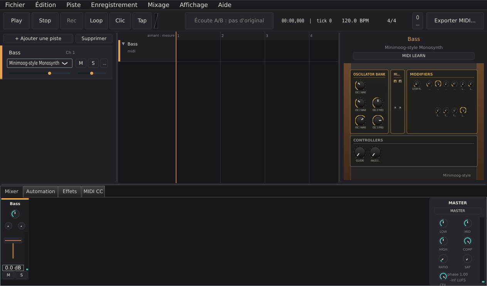

*La fenêtre unique : transport, pistes à gauche, arrangement au centre, rack de la piste sélectionnée à droite, console en bas.*

## 2. L'arrangement

C'est la vue où le morceau existe. Chaque ligne est une piste, chaque bloc un **clip** — un morceau de musique qu'on déplace, redimensionne, coupe et duplique à la souris, avec annulation. Un clip posé deux fois ne duplique pas ses notes : éditer l'un modifie l'autre.

Sous le nom de chaque piste, une ligne grise dit ce qu'elle est : `midi`, `audio`, `groupe`, et `gelé` quand la piste a été reportée en audio pour ne plus coûter que le prix d'une lecture. Le triangle plie la piste ; les hauteurs se règlent, les pistes se réordonnent, les couleurs se choisissent.

L'automation se dessine **sur** l'arrangement, pas dans un onglet à part : la ligne claire au-dessus des clips de basse est `mix.volume`, avec ses points. En haut à gauche, l'aimant dit à quoi les gestes se calent — ici la mesure.

Un échantillon glissé depuis le navigateur tombe sur la piste survolée, **à la mesure aimantée**, et un trait doré le montre pendant le glisser : poser à trois millisecondes du premier temps est le genre de décalage qu'on ne voit pas et qu'on entend.

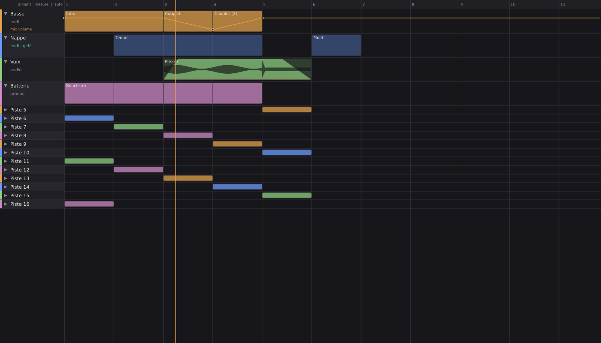

*La vue d'arrangement : quatre pistes nommées, des clips, une automation dessinée, seize pistes visibles à l'écran.*

## 3. Le rack

Trente-neuf machines, plus une tonalité d'essai qui n'a pas de façade parce qu'elle
n'a rien à régler. Chacune porte une **empreinte de non-régression audio** qui fige son rendu.

Elles répondent au **jeu MIDI** selon leur nature, jamais par politesse : la molette de
hauteur plie tout ce qui a un geste de hauteur continue (synthés, cordes, vents, voix,
multisample — vingt-quatre machines), la molette de modulation et l'aftertouch dosent un
vibrato là où un LFO existe (quinze), le program change règle le programme du multisample.
Un piano, un orgue à roues ou une boîte à rythmes **refusent** — leur instrument n'a pas ce
geste — et le moteur compte chaque refus, pour que l'interface puisse dire pourquoi une
modulation ne s'entend pas.

### Monophoniques — la ligne de basse et le solo

Une voix à la fois, un portamento, et une enveloppe qui claque. C'est le registre où la reconstruction va chercher ses basses.

**Minimoog-style Monosynth** — `vsm.minimoog`

Trois oscillateurs, filtre échelle 4 pôles, glide et dérive analogique.

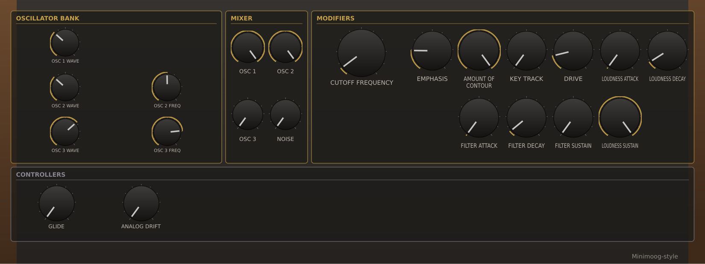

**TB-303-style Acid Synth** — `vsm.tb303`

L'accent et le glide sont le sujet ; sans eux ce n'est pas une 303.

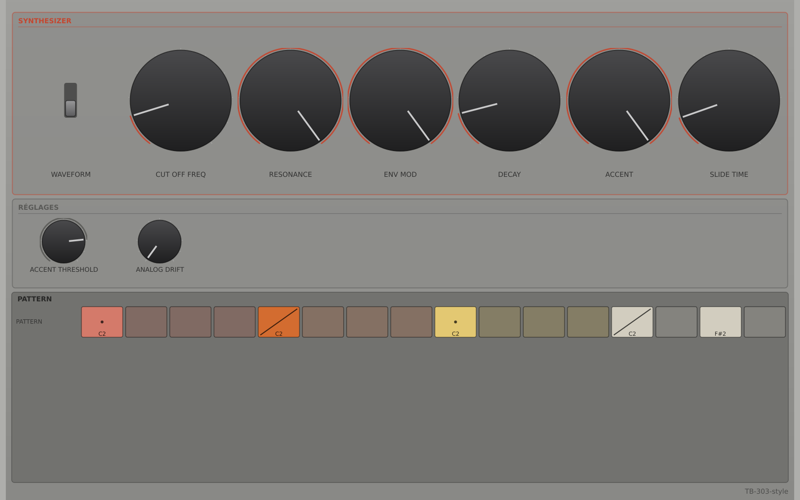

**SH-101-style Monosynth** — `vsm.sh101`

Mono, sub-oscillateur, enveloppe VCA en mode gate ou enveloppe.

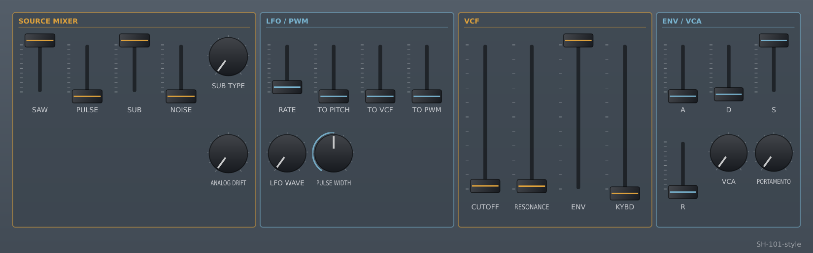

**PSG (puce 8 bits)** — `vsm.psg`

Le générateur de sons des consoles : trois canaux carrés et un bruit.

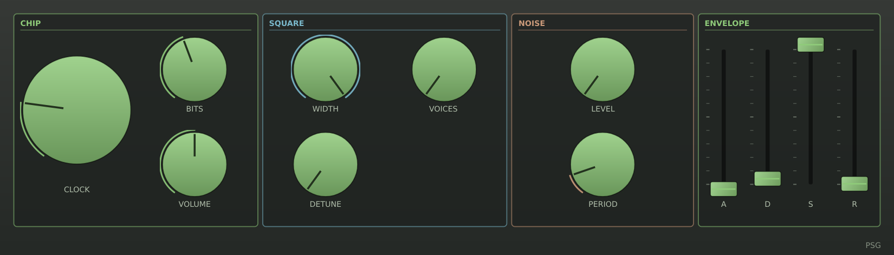

### Polyphoniques analogiques — les nappes et les accords

Plusieurs voix, une par touche, et des filtres qui respirent. C'est ce que la chaîne essaie d'abord sur un stem `other`.

**Juno-106-style Polysynth** — `vsm.juno106`

Un oscillateur, un sub, et le chorus BBD qui fait la moitié du son.

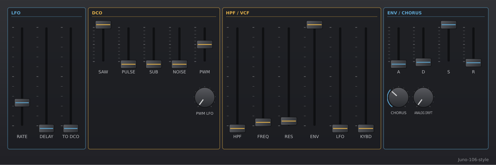

**Jupiter-8-style Polysynth** — `vsm.jupiter8`

Huit voix, cross-modulation, sync, passe-haut, largeur stéréo.

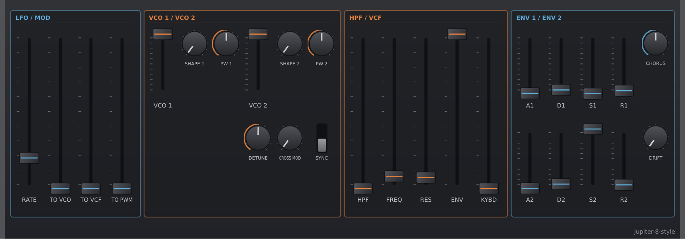

**Prophet-style Polysynth** — `vsm.prophet`

Cinq voix, poly-mod de l'oscillateur B vers le filtre, hard-sync.

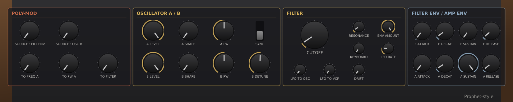

**OB-style Polysynth** — `vsm.obx`

Le filtre 2 pôles et la nappe large ; un autre grain que le 4 pôles.

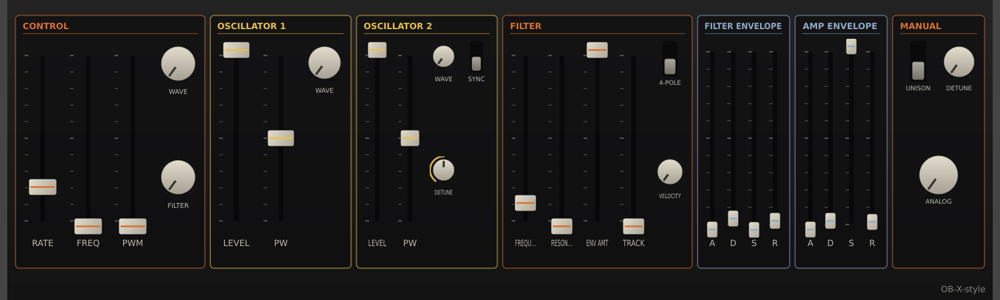

**MS-20-style Semi-modular** — `vsm.ms20`

Deux filtres en série, passe-haut et passe-bas, auto-oscillation bornée.

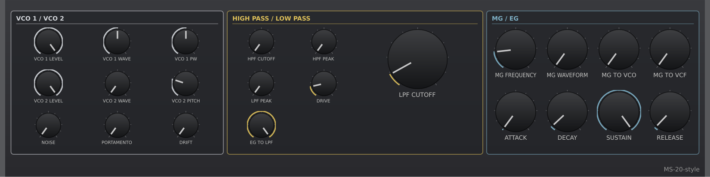

**ARP-Odyssey-style Duophonic** — `vsm.arpodyssey`

Duophonie grave/aigu, modulateur en anneau, échantillonneur-bloqueur.

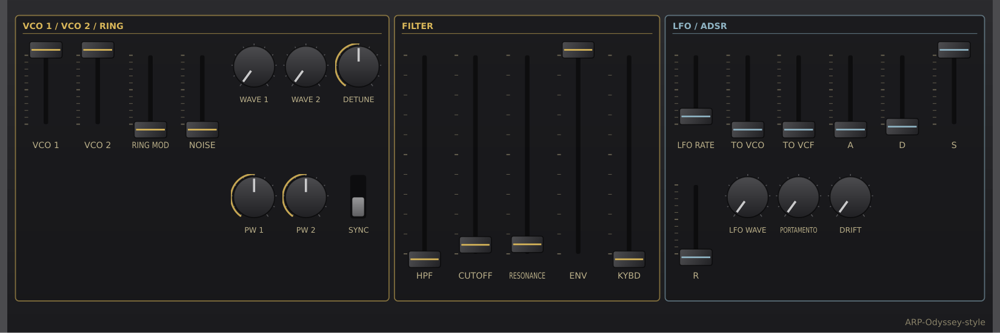

**Supersaw Lead** — `vsm.supersaw`

Sept dents désaccordées : la nappe trance, et rien d'autre.

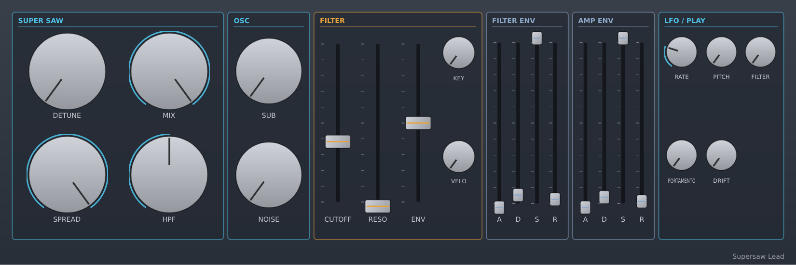

### Numériques — le spectre construit autrement

Ni soustractif ni échantillon : des familles où le timbre naît d'un calcul.

**DX7-style FM Synthesis** — `vsm.dx7`

Six opérateurs, algorithmes, feedback, enveloppes par opérateur.

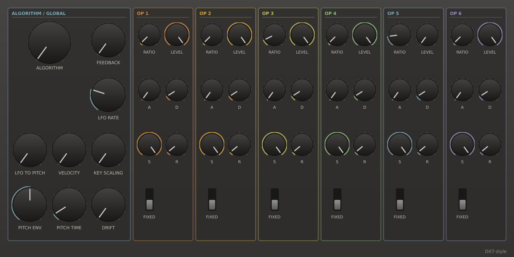

**Phase Distortion (le temps déformé)** — `vsm.phasedist`

On déforme la lecture de la table, pas la table : le brillant sans filtre.

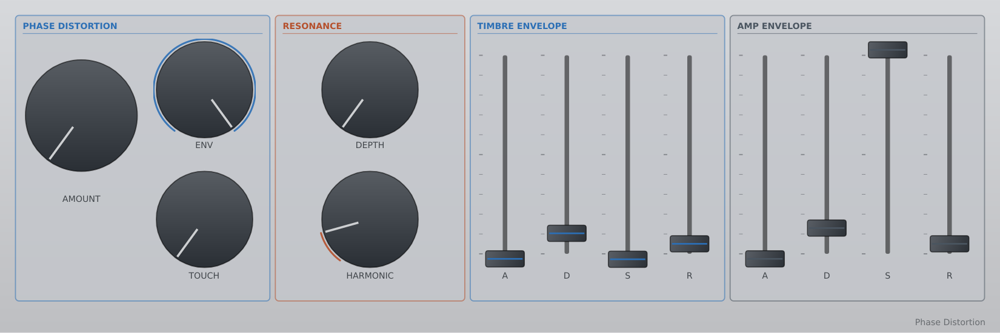

**Wavetable Synth** — `vsm.wavetable`

Un balayage dans une table d'ondes ; le mouvement est dans la position.

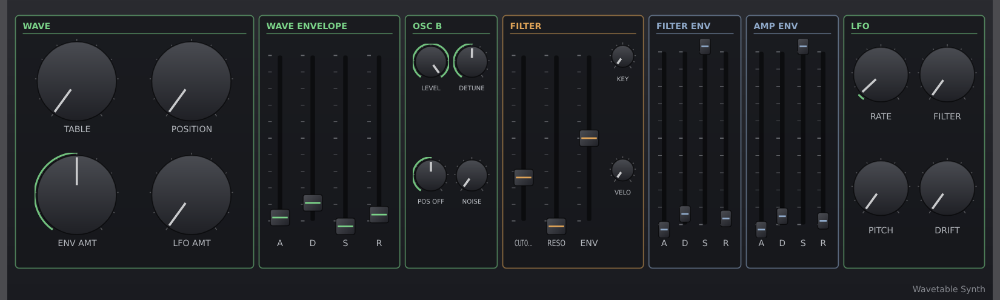

**Additive (le spectre rang par rang)** — `vsm.additive`

Chaque harmonique a son niveau et son enveloppe. Cher, et exact.

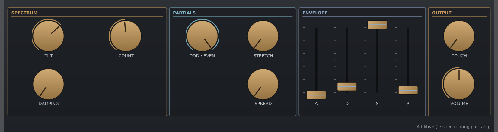

**PCM + Synth Hybrid** — `vsm.pcmhybrid`

Une attaque échantillonnée collée sur une queue synthétisée.

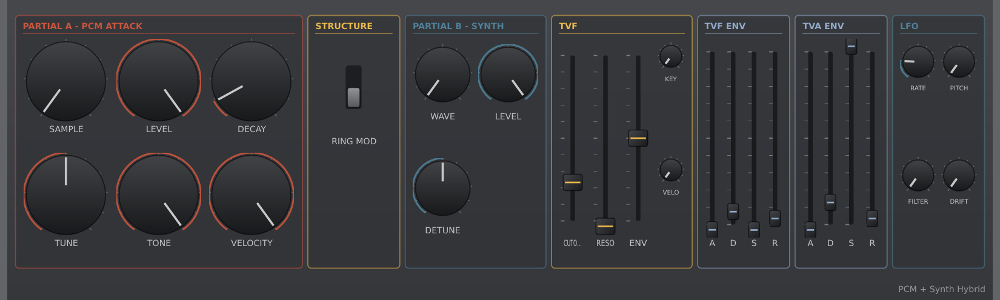

**West Coast (pliage et porte passe-bas)** — `vsm.westcoast`

Le pliage d'onde et la porte passe-bas de l'école Buchla.

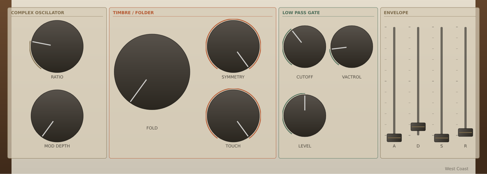

**Chebyshev (le spectre commandé)** — `vsm.chebyshev`

Huit curseurs, un par harmonique : on écrit le spectre et on l'obtient
exactement. L'index fait la brillance — une note qui décroît s'assombrit
d'elle-même, et la machine n'a aucun filtre.

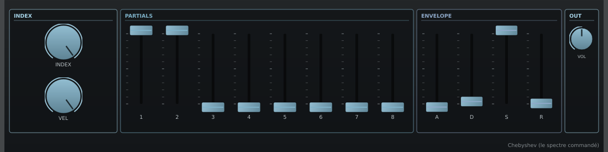

**Modal (l'objet frappé)** — `vsm.modal`

Les modes d'un objet — barre, cloche, verre — et non les harmoniques d'une
corde : le second partiel peut se placer à 2,76 fois le fondamental, ce
qu'aucune autre machine ne sait faire. Le point de frappe annule les modes
dont il est un nœud, la dureté du maillet décide lesquels s'éveillent.

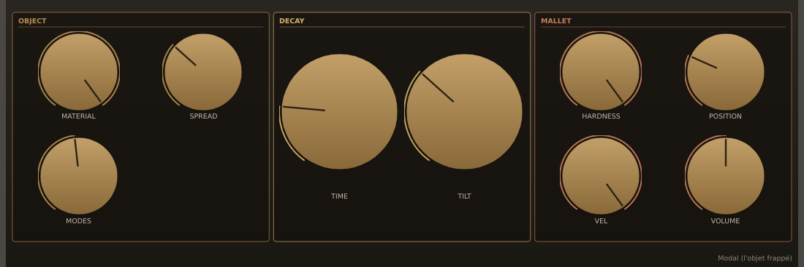

**CS-80-style (deux couches, pression par note)** — `vsm.cs80`

Une touche allume DEUX synthétiseurs complets, dont on dose le mélange — et
la pression sur cette touche ouvre le filtre de CETTE note, pas des autres.
C'est la seule machine du parc dont la modulation soit par voix.

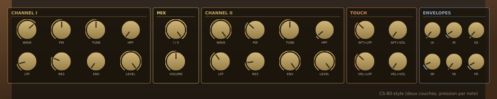

**Vector (quatre coins, un trajet)** — `vsm.vector`

Quatre timbres aux coins d'un carré, une position qui les mélange, une orbite
qui la promène : la couleur bouge sans qu'aucun filtre ne bouge.

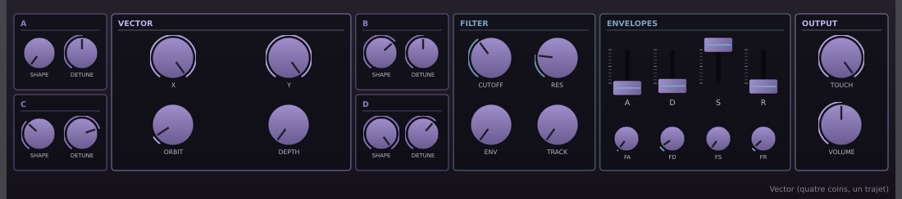

**Granular (le nuage de grains)** — `vsm.granular`

Des grains fenêtrés, une densité, une dispersion : le continuum de la note
nette à la texture qui scintille — et le nuage est rejouable au bit près.

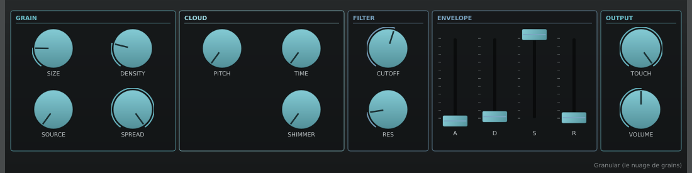

**Stochastic (la forme qui divague)** — `vsm.stochastic`

La forme d'onde dérive au hasard, seedée : bruité mais reproductible.

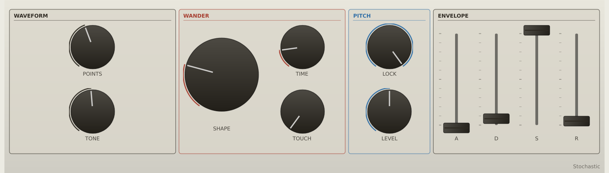

### Claviers et orgues

Les instruments à clavier dont le timbre ne vient pas d'un filtre.

**Tonewheel Organ** — `vsm.tonewheel`

Roues phoniques, tirettes harmoniques, percussion et rotatif.

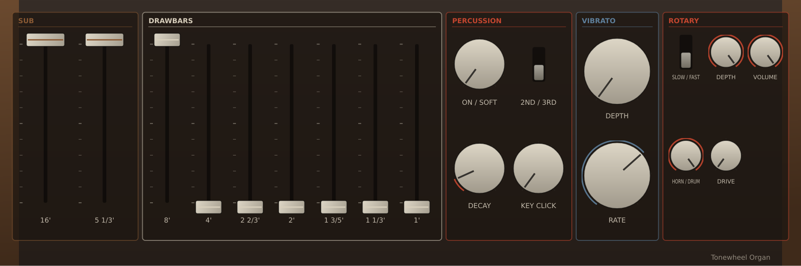

**Electric Piano (lames)** — `vsm.epiano`

Une lame frappée devant un micro : la cloche et le grognement.

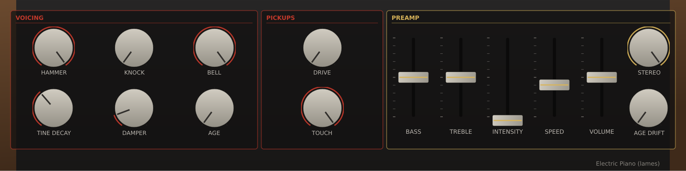

**Divider (cordes électroniques)** — `vsm.divider`

Un oscillateur maître divisé : l'orgue à cordes des années 70.

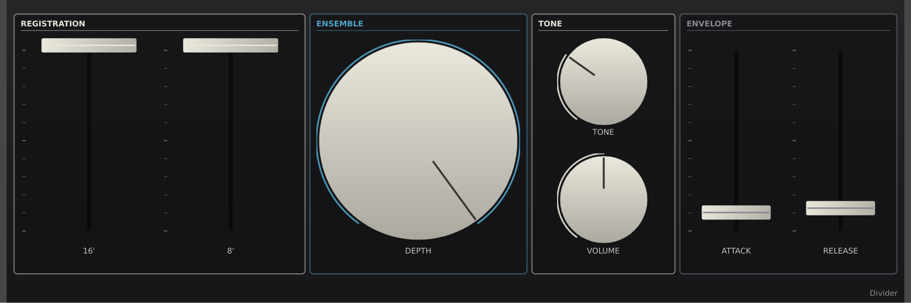

**Piano (cordes frappées)** — `vsm.piano`

Cordes frappées modélisées, avec la table d'harmonie.

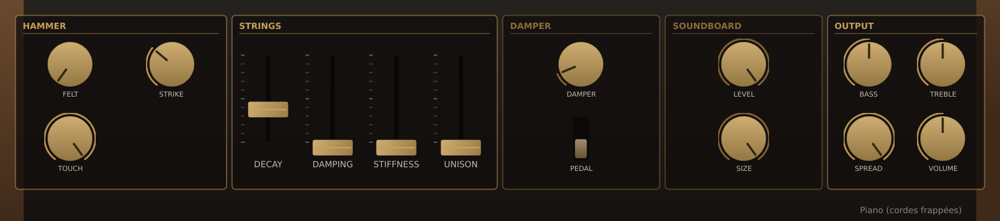

### Modèles physiques — l'instrument acoustique simulé

Ici la machine ne dessine pas une onde : elle simule le corps qui la produit.

**String (corde pincée / frottée)** — `vsm.string`

Guide d'ondes ; l'archet et le plectre sur la même corde.

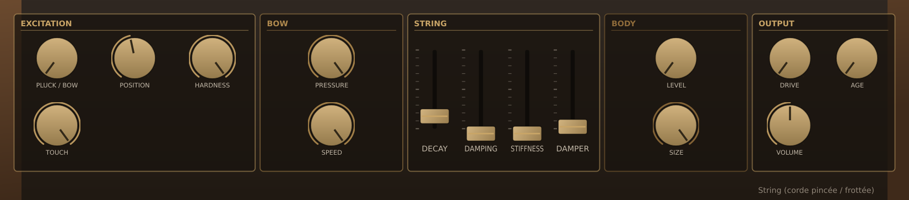

**Wind (anche et lèvres)** — `vsm.wind`

Perce cylindrique : la clarinette et, en approche, les cuivres.

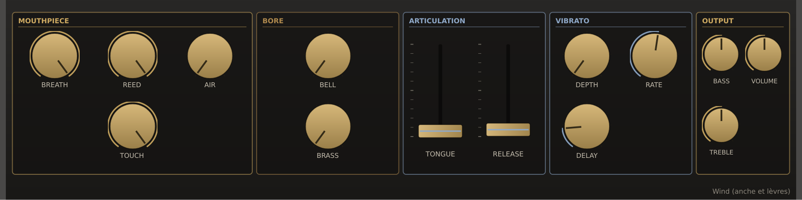

**Cone (anche sur perce conique)** — `vsm.cone`

Perce conique : le saxophone et le hautbois — les rangs pairs que le cylindre
interdit. Mêmes commandes que Wind ; ce qui les sépare est la perce, et
l'EMBOUCHURE y échange le mordant impair contre le corps pair.

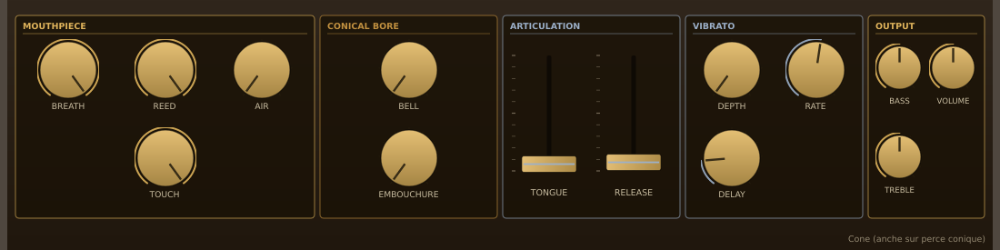

**Drums (batterie acoustique)** — `vsm.drums`

Peaux, fûts et cymbales modélisés, pièce par pièce.

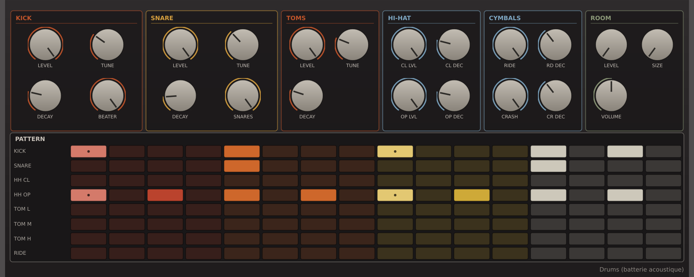

**Percussion (peaux et barres, modal)** — `vsm.perc`

Synthèse modale : le bois, le métal, la peau tendue.

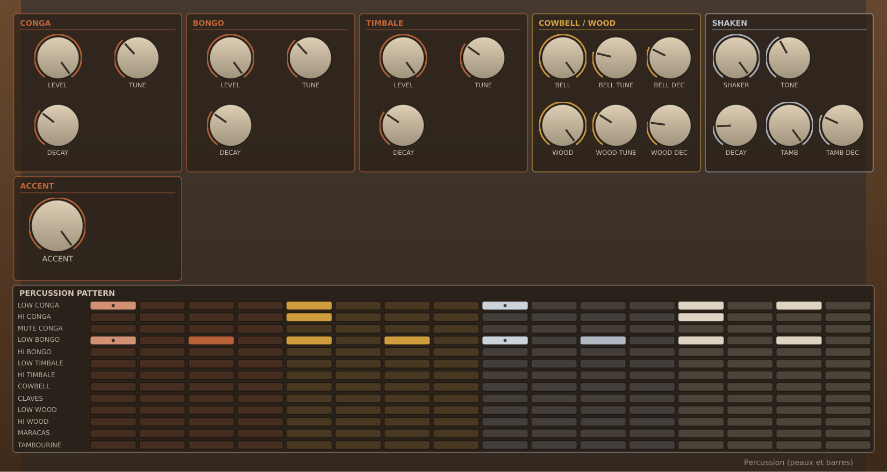

**Vocal (conduit vocal, voyelles)** — `vsm.vocal`

Source glottique et trois formants ; les formants ne suivent pas la note.

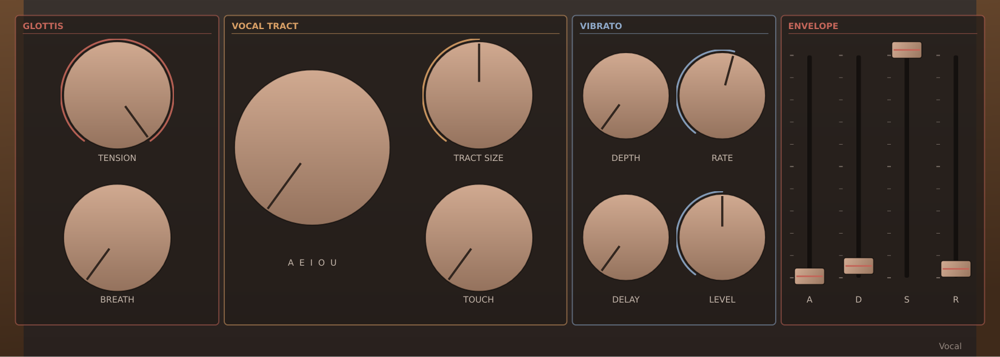

### Percussions électroniques

Les boîtes à rythmes, et la voie métallique.

**TR-808-style Drum Machine** — `vsm.tr808`

Le kick long, le clap, les toms accordés.

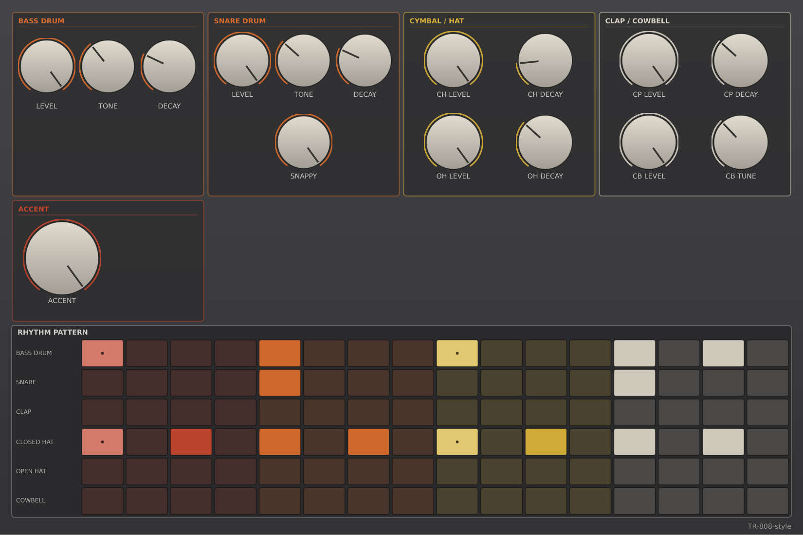

**TR-909-style Drum Machine** — `vsm.tr909`

L'attaque échantillonnée des charlestons, le kick qui claque.

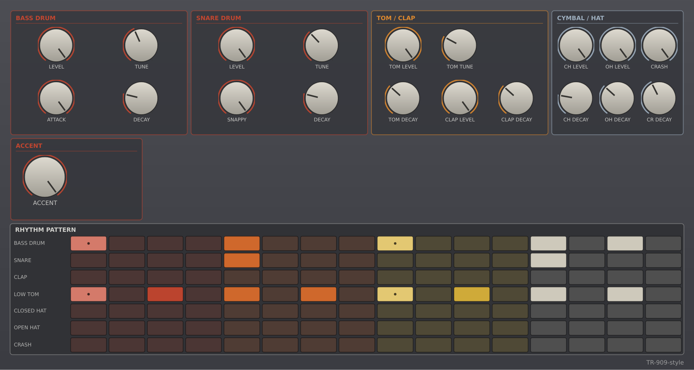

**FM Drums (percussions métalliques)** — `vsm.fmdrums`

La percussion par FM : cloches, blocs, métal.

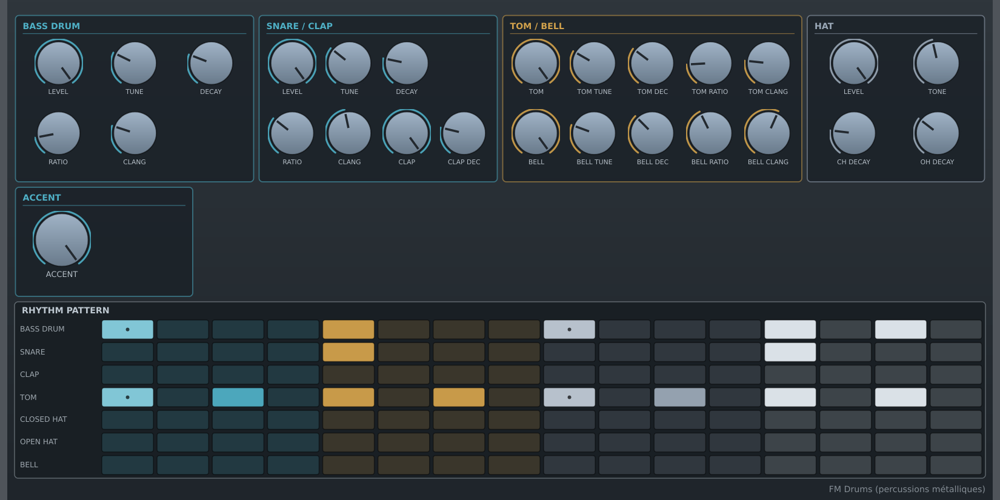

### Échantillons

Quand rien ne se modélise honnêtement, on reporte le son tel quel — et on le dit.

**Sampler (8 emplacements)** — `vsm.sampler`

Huit emplacements déclenchés par note. Le report de la voix passe par là.

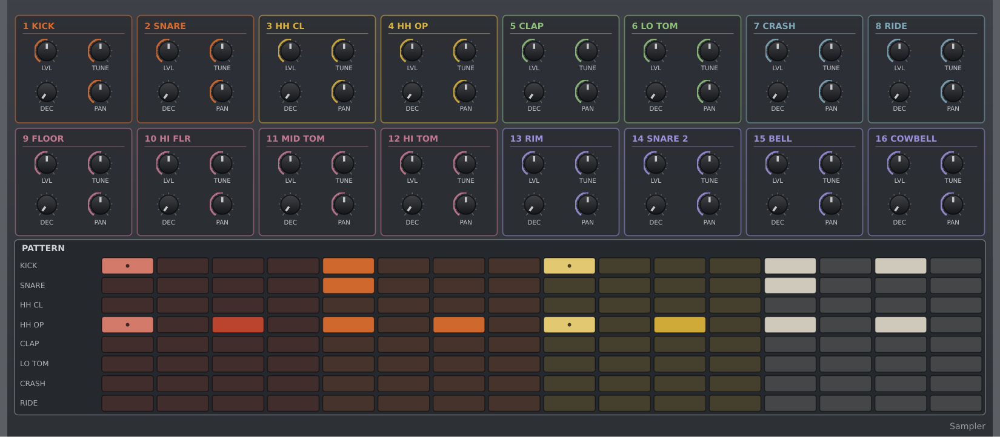

**Multisample (acoustique échantillonné)** — `vsm.multisample`

Profils multi-échantillons installables ; l'orchestre General MIDI arrive par là.

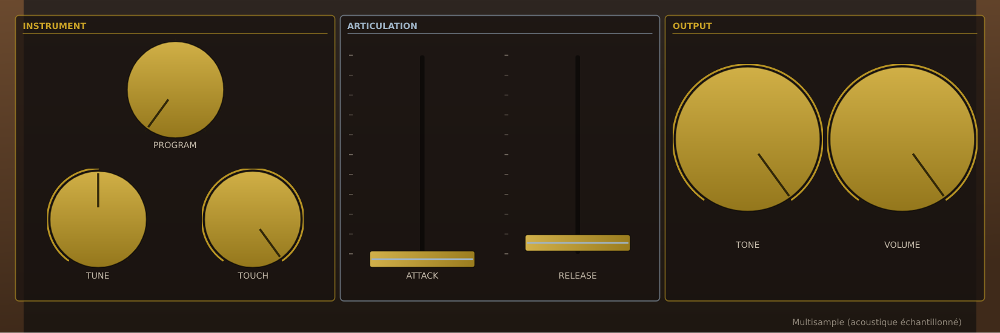

### Utilitaire

Une machine qui n'imite rien, faite pour être cherchée.

**Generic Synth** — `vsm.generic`

Un soustractif neutre, aux axes bien rangés : la machine que la recherche de patch explore le mieux.

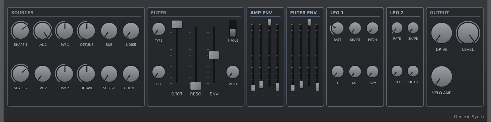

## 3. Le piano roll

Le clavier de gauche donne l'échelle ; les octaves sont marquées en clair. Une note se dessine, se déplace, s'allonge ; la vélocité se règle et passe par l'historique.

Les **notes hachurées** ne sont pas des notes ordinaires : ce sont celles dont la transcription doute. Après une reconstruction, on les parcourt une par une pour décider — c'est le seul endroit où l'oreille tranche ce que la mesure n'a pas su trancher.

En haut, les **marqueurs** (`Intro`, `Pont`) sont des entités du projet, pas des étiquettes décoratives : ils survivent à l'aller-retour disque et à l'export MIDI.

Une trentaine d'opérations d'édition musicale sont disponibles — gammes, accords, arpèges, legato, quantification — et toutes passent par l'historique global : une opération sur trois pistes s'annule d'un seul geste.

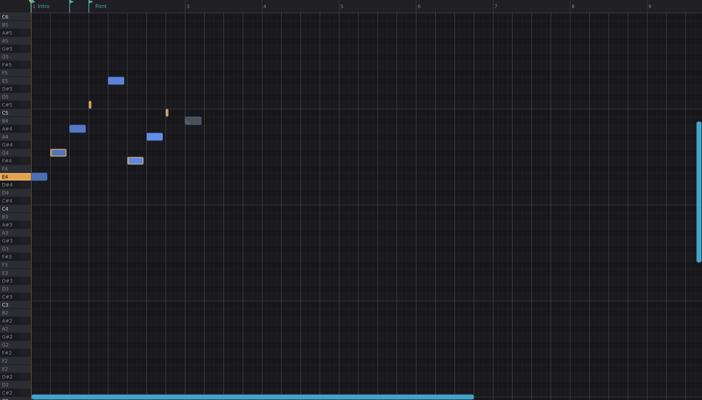

*Le piano roll : notes, marqueurs de section, note de tête sélectionnée, et une note douteuse hachurée.*

## 5. Le navigateur

Une seule liste pour tout ce qu'on peut poser sur une piste : les **machines** du parc, les **presets** `*.synth.json`, les **profils** multi-échantillons et les **échantillons**. La colonne de droite dit d'où vient chaque chose — et jusqu'au sous-dossier, parce que deux « basse » rangées à deux endroits doivent se distinguer sans qu'on ait à les essayer.

La recherche est délibérément simple : tous les mots, dans n'importe quel ordre, sans casse, dans le nom ou l'origine. `303 acid` trouve « TB-303 Acid Lead » comme « acid lead (tb303) ». **Il s'ouvre plein, pas vide** : on l'ouvre justement pour voir ce qu'il y a.

Deux gestes. Le double-clic applique à la piste sélectionnée — le geste court, qui suppose qu'on a la bonne piste en tête. Le glisser dépose sur la piste qu'on **voit**, soulignée pendant le survol. Un preset emporte sa machine : appliquer un preset de TB-303 sur un DX7 changerait des paramètres qui n'ont pas le même sens, donc la piste change de machine.

L'inventaire ne lit aucun contenu — des noms de fichiers et des extensions —, ce qui le rend instantané sur un dossier de plusieurs milliers d'échantillons.

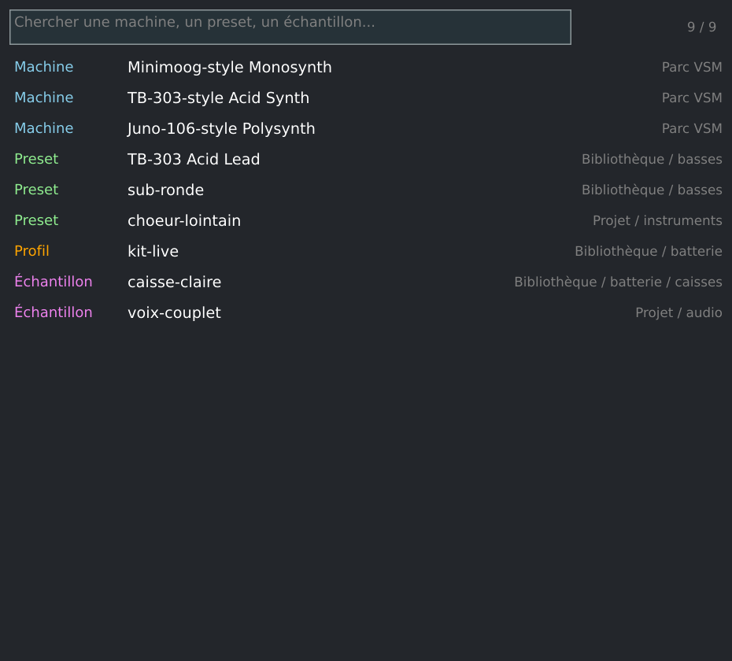

*Le navigateur : machines, presets, profils et échantillons dans une seule liste, avec leur origine.*

## 6. Reconstruire un morceau

Glissez un fichier audio sur l'application : elle en fait un projet. La chaîne sépare le morceau en stems, transcrit les notes, cherche pour chaque piste la machine et le patch les plus proches, puis ouvre le résultat comme un projet — pas comme un dossier à charger.

Chaque étape s'affiche et **l'opération s'annule**. Le journal dit ce qui a été décidé et pourquoi : ici, sur la basse, `vsm.minimoog réglée PASSE DEVANT` — le réglage de piste a battu le patch d'origine au verdict du mélange.

Si Python n'est pas installé, la fonction est **grisée avec sa raison**, jamais une erreur au milieu du travail. Le dossier de la chaîne d'analyse se désigne dans les préférences, qui disent `Prête.` quand elle est utilisable.

Ce que la chaîne ne fait pas : couper une piste. Elle mesure le morceau rendu **sans** chaque piste et le publie au rapport, mais garder ou couper reste une décision humaine.

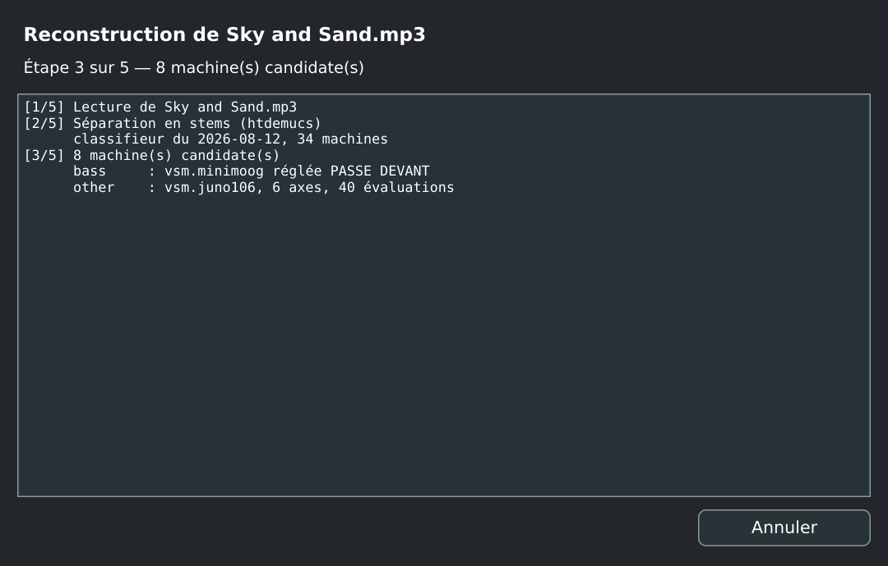

*La reconstruction en cours : cinq étapes, le journal en direct, et un bouton pour annuler.*

## 7. Les réglages

Tout ce qui se règle est au même endroit. Un réglage qu'on ne retrouve qu'en se souvenant du menu où il se cache est un réglage qu'on ne change pas.

**La taille de l'interface** agit globalement et se conserve d'une exécution à l'autre. 150 % est le réglage par défaut : en cas de doute entre « ça tient dans la case » et « ça se lit », c'est la lisibilité qui prime.

**Les threads de rendu** suivent la machine par défaut. **La chaîne d'analyse** et **la bibliothèque** du navigateur se désignent ici, et leur état est dit.

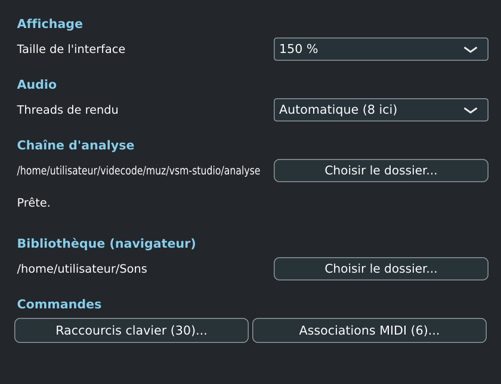

*Les préférences : tout ce qui se règle, au même endroit.*

### Les raccourcis

Chaque commande est déclarée une fois, avec son libellé, sa famille et sa touche par défaut. Une touche pressée désigne une **commande**, jamais un code de touche perdu dans un `switch` : un raccourci qui n'apparaît pas dans cette page n'existe pas.

Un conflit se dit **avant** d'être créé, en nommant la commande qui tient déjà la touche. Une touche vide **désactive** une commande, et c'est un choix légitime. Pendant une capture, la touche est une donnée et non une commande — sans quoi on ne pourrait jamais réassigner `Espace`, c'est-à-dire aucune des touches qu'on veut changer.

Les flèches ne se reconfigurent pas : leur sens **est** leur direction. Elles figurent quand même dans la table, marquées comme fixes — une page qui prétend tout lister et tait quatre touches ment davantage qu'une page qui dit « celles-ci ne bougent pas ».

La table **s'imprime**, en texte : on l'imprime, on la colle au mur du studio, on la cherche avec Ctrl+F. Une capture d'écran ne ferait aucune des trois.

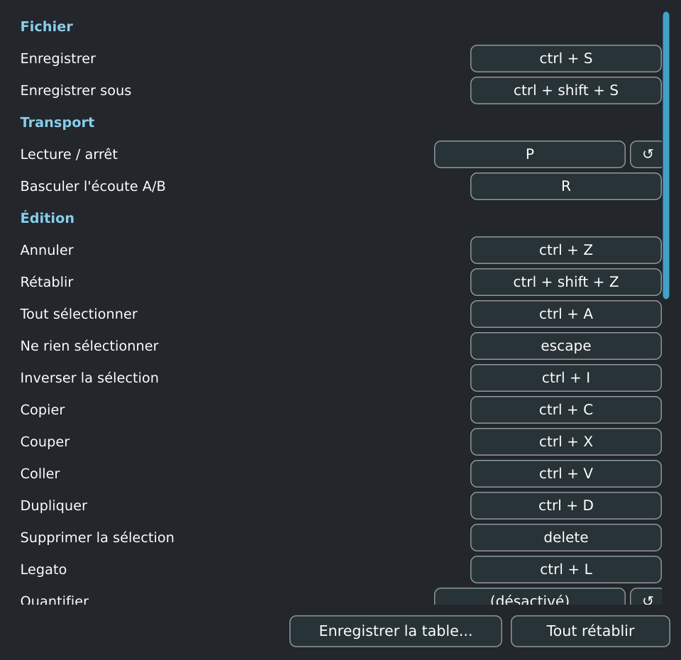

### Les associations MIDI

Un potentiomètre physique s'associe à un réglage, et **s'en souvient d'une session à l'autre** : ce qui se perdait à chaque lancement n'était pas une préférence de confort, c'était le câblage d'un studio, refait à la main à chaque démarrage.

La fenêtre propose les cibles, et **seulement celles qui existent** — un départ n'apparaît que si le projet le déclare, les réglages de piste que s'il y a une piste choisie. Promettre une association qui ne ferait rien serait pire que de ne pas la proposer.

La liste dit `CC 74 → piste 4 · Resonance`, avec le nom que la **machine** donne au paramètre — pas son numéro, qui n'aide personne. Et chaque association se défait.

Une bascule s'appuie, un fader se positionne : traiter l'un comme l'autre ferait démarrer la lecture au milieu d'une course de potentiomètre. Le seuil est celui du MIDI, 64.

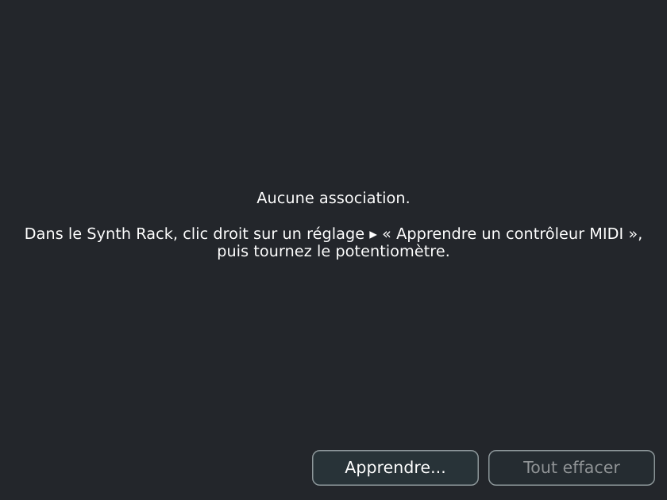

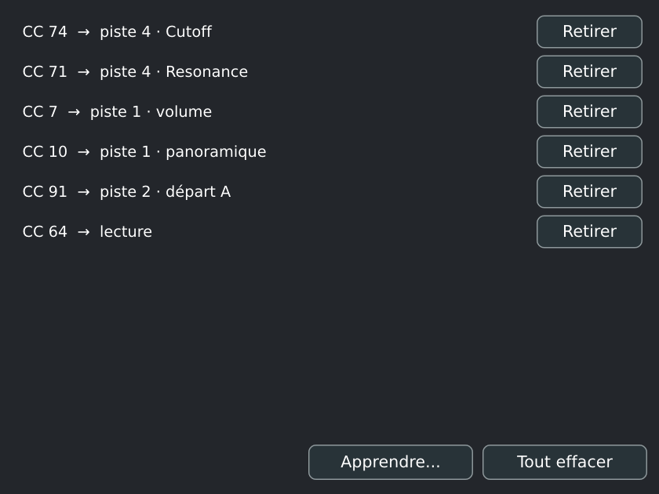

### Regarder l'application sans souris

Trois variables d'environnement, pour vérifier une interface plutôt que de
l'affirmer : `VSM_CAPTURE=sortie.png` fait que la fenêtre se photographie
elle-même deux secondes après l'ouverture puis quitte ; `VSM_VUE=nom,nom`
actionne le menu Affichage ; `VSM_PROJET=dossier` ouvre un projet au
démarrage — sans lui, l'autoportrait ne montre qu'un projet vide, alors que
ce qu'on a besoin de regarder est presque toujours une machine dans son rack
ou un arrangement précis.

## 8. Ne rien perdre

Le projet est photographié **toutes les trente secondes**, et seulement s'il a changé — un studio ouvert sans qu'on y touche n'a aucune raison d'écrire. L'écriture se fait hors du thread de l'interface, et à côté du fichier avant de basculer : une sauvegarde interrompue en cours d'écriture détruirait justement ce qu'elle protège.

Au démarrage, une session qui s'est interrompue est proposée — avec son nom, sa date et ce qu'elle contient : *« Sky and Sand — 12 piste(s), 4821 note(s), enregistré automatiquement il y a 3 minutes »*. Quand le projet n'avait **jamais** été enregistré, elle le dit : c'est le cas où l'on ne perd pas une minute mais tout.

Ce qui distingue « ça a planté » de « c'est ouvert dans une autre fenêtre » est un verrou entre processus, et rien d'autre. Proposer de récupérer une session en train de travailler serait pire que ne rien proposer.

La sauvegarde automatique **n'écrit pas les médias** : recopier une prise de deux cents mégaoctets toutes les trente secondes ferait d'elle la panne dont elle devait protéger. Elle retient le dossier d'origine, et les chemins restent relatifs. *« Enregistrer un projet autonome »*, lui, emporte tout et s'ouvre sur une autre machine.
